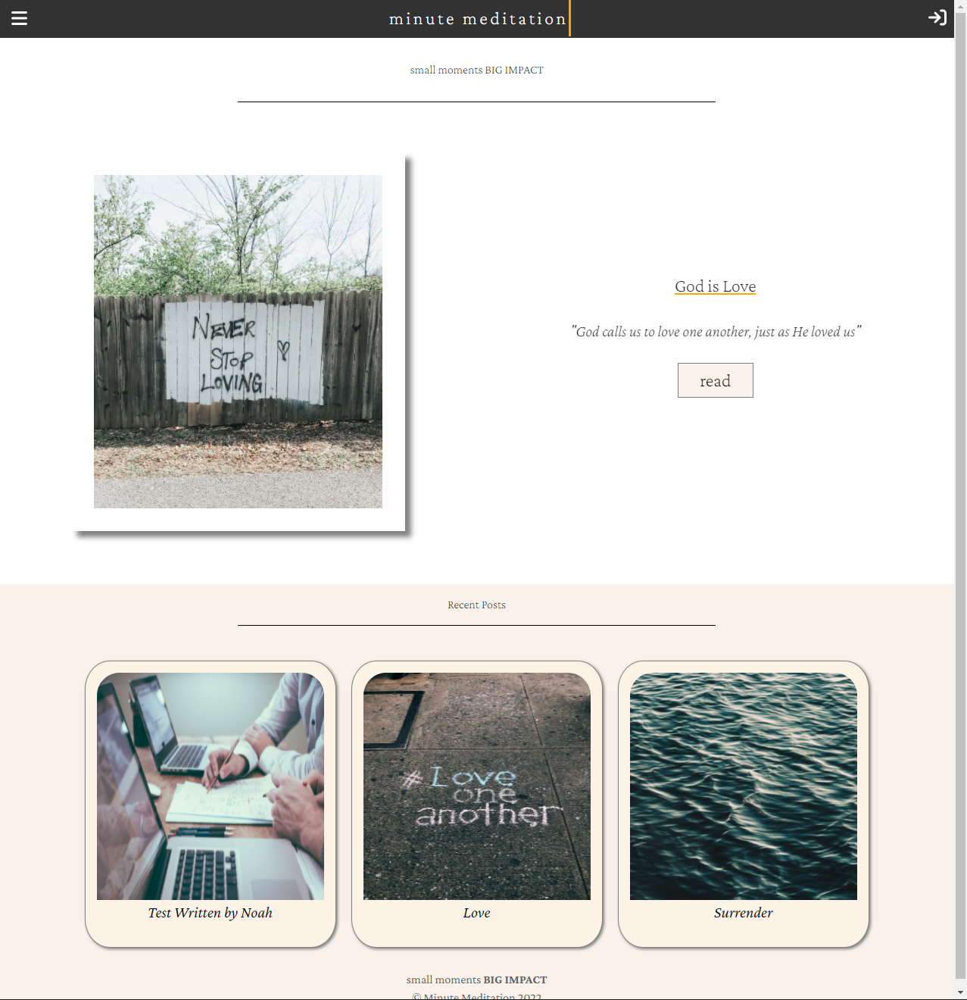
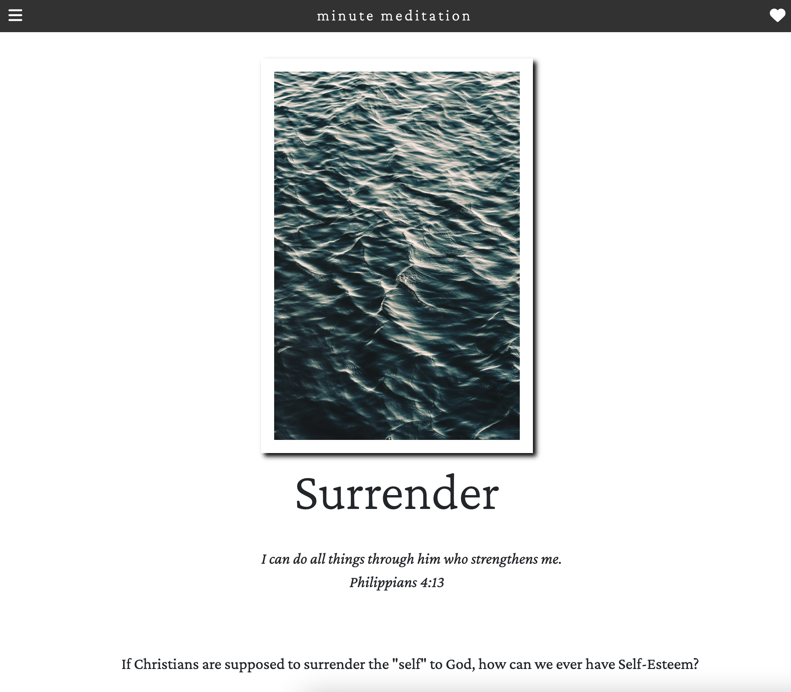

# minutemeditationblog

As of April 2, 2022
User Log In and Registration is up and running!

The NAVBAR now has a Log-In or Log-Out button on the top right, depending on whether someone is logged in or not.

Those who are NOT logged in (not authorized) will not have access to creating new posts and will not have acceess to editing/deleting a post.
Also, those who are logged in but NOT the author of the post will not have access to editing/deleting another author's posts. 
Only the author can delete their own post.

HOME SCREEN now has LOG IN or LOG OUT button on top right.

ARTICLE SCREEN has no button for "New Articles" if user is not logged in, but has the button if user is logged in.

BLOG PAGE has no button for EDTING or DELETING if user is not logged in OR if user is not the author. Only the author can edit or delete their article.

---

---

As of March 30, 2022:
Currently creating a blog site for a Christian writer.

The site's backend is currently working, storing Blog Data in MongoDB Atlas. 
On the backend, I am also developing a User Log In with varying credentials to allow varying levels of accessibilities to different users.

Also, completely remaking the Front-End of the Site to make a personal and unique design. 

Home Screen on Mobile:
There are some CSS animations and a working Menu bar made with CSS and Javascript.

Home Screen on Mobile, Scroll Down:
If you scroll down, the most recent articles are automatically updated and presented.

Home Screen on Desktop:

Blog Screen on Mobile:

Blog Screen on Desktop:

